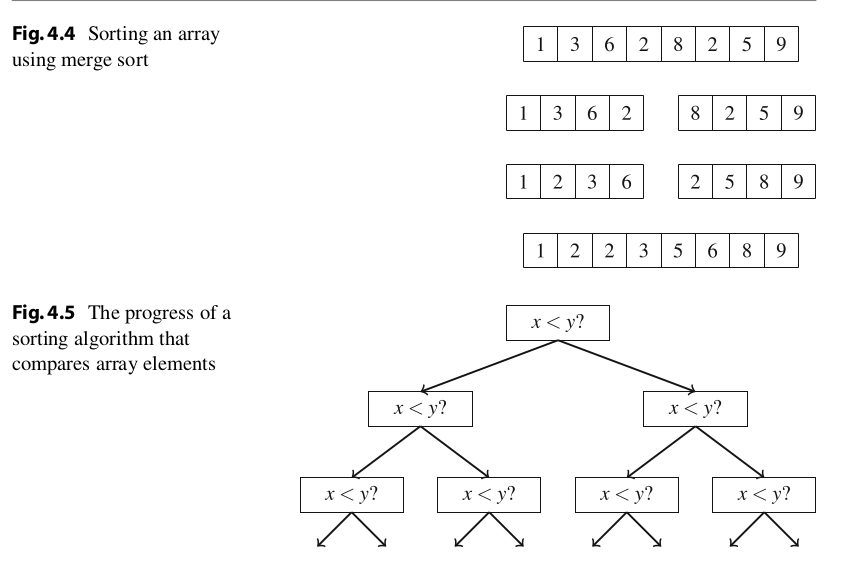

# Searching and Sorting
Note: This is not a Full-Course Note, it is written keeping CP  in mind, so only optimal techniques have been discussed.
## 1. Bubble Sort
- Bubble sort is a simple sorting algorithm that works in O(n<sup>2</sup> ) time.

```cpp
for (int i = 0; i < n; i++) {
	for (int j = 0; j < n-1; j++) {
		if (array[j] > array[j+1]) {
			swap(array[j],array[j+1]);
		}
	}
}
```

## 2. Merge Sort
- Time Complexity: O(n logn)
- Merge sort sorts a subarray array[a . . . b] as follows: 
	1. If a = b, do not do anything, because a subarray that only contains one element is already sorted.
	2. Calculate the position of the middle element: k = [(a + b)/2].
	3. Recursively sort the subarray array[a . . . k].
	4. Recursively sort the subarray array[k + 1 . . . b].
	5.  Merge the sorted subarrays array[a . . . k] and array[k + 1 . . . b] into a sorted subarray array[a . . . b]

- 

## Applications:
1. Suppose that we want to check if all elements in an array are unique. A brute force algorithm goes through all pairs of elements in O(n 2 ) time:

```cpp
bool ok = true;
for (int i = 0; i < n; i++) {
	for (int j = i+1; j < n; j++) {
		if (array[i] == array[j]) ok = false;
	}
}
```

1. (Alternative)

```c
bool ok = true;
sort(array, array+n);
for (int i = 0; i < n-1; i++) {
	if (array[i] == array[i+1]) ok = false;
}
```

----
## 1. Binary Search
- Binary search is an O(log n) time algorithm that can be used, for example, to efficiently check whether a sorted array contains a given element.
### 1.1 Implementing Binary Search
<b>First Method :</b>
- The most common way to implement binary search resembles looking for a word in a dictionary.
- The search maintains an active subarray in the array, which initially contains all array elements. Then, a number of steps are performed, each ofwhich halves the search range. At each step, the search checks the middle element of the active subarray.
-  If the middle element has the target value, the search terminates. Otherwise, the search recursively continues to the left or right half of the subarray,depending on the value of the middle element.
-  Code:

```c
int a = 0, b = n-1;
while (a <= b) {
	int k = (a+b)/2;
	if (array[k] == x) {
	// x found at index k
	}
	if (array[k] < x) a = k+1;
	else b = k-1;
}
```

<b>Second Method :</b>
- Another way to implement binary search is to go through the array from left to right making jumps. 
- The initial jump length is n/2, and the jump length is halved on each round: first n/4, then n/8, then n/16, etc., until finally the length is 1.
-  On each round, we make jumps until we would end up outside the array or in an element whose value exceeds the target value. After the jumps, either the desired element has been found or we know that it does not appear in the array.
-  Code:
```c
int k = 0;
for (int b = n/2; b >= 1; b /= 2) {
	while (k+b < n && array[k+b] <= x) k += b;
	}
	if (array[k] == x) {
	// x found at index k
}
```