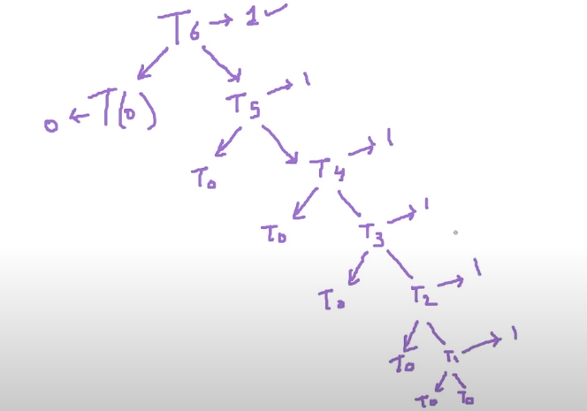

# How to Calculate Time Complexity ?
Approach to calculate the Time Complexity:
1. Drop the Non-Dominant Terms
2. Drop the Constant Term
3. Break the Code into Fragments
---
<b>Example 1:</b>

``` cpp
int i=0; n=10;   // Suppose it takes K1 Time
for (int i=0;i<n;i++)
{
	k=i;
	k++;   // Suppose it takes k2 time
}
for (int j=0;j<n;j++)
{
	k+=j;
	k--;   // Suppose it takes k3 time
}

```
Now, if we calculate the time complexity of the above code according to approach given on top, 
- Total time: k1 + k2.n + k3.n
	- <u>Drop Non-Dominant Term:</u>  k2.n + k3.n
	 	= n(k2 + k3)
	 - <u>Drop Constant Term: </u> O(n) <-- Time Complexity
--- 
<b>Example 2:</b>
```cpp
int k=0;n=10
for(int i=0;i<n;i++)
{
	for(int j=0;j<n;j++)
	{
		k=i;
		k++;
	}
}

```
Explanation: 

We can see there is a case of nested loop, which means, for each value of i (1,2,3,....,n) the inner loop will run n times.
for i = 0 : j = 0,1,2,3, .... , (n-1)
for i =1 : j = 0,1,2,3, ...... , (n-1)
Thus, the time complexity for inner loop will be O(n) and so will be the time complexity of outer loop. 
 - We can thus write the time complexity of the programs as : O(n<sup>2</sup>).

---
### Questions
1. Find Time Complexity of foo function:

``` c
#include <stdio.h>

void foo(int array[], int length)
{
    int sum = 0;
    int product = 31;		//k0
    for (int i = 0; i < length; i++)	//k1
    {
        sum += array[i];
    }
    for (int i = 0; i < length; i++)	// K2
    {
        product *= array[i];
    }
}
int main()
{
    int arr[] = {3, 5, 66};
    foo(arr, 3);
    return 0; 
}
```
Time complexity: k0+ k1.n + k2.n <br> --> O(n)

---

2. Find Time Complexity

```c
#include <stdio.h>
void func(int n)
{
    int sum = 0;
    int product = 1;
    for (int i = 0; i < n; i++) // k1
    {
        for (int j = 0; j < n; j++)   //k2
        {
            printf("%d , %d\n", i, j);
        }
    }    
}
int main()
{
    func(4);
    return 0;
}
```
Time Complexity: k1.n (k2.n) <br> --> O(n<sup>2</sup>)

---
3. Consider the recursive Algo, where the random(int) is taking one unit time, if Avg. Processing time is T(n), what is value of T(6) ?
```c
int function(int n)
{
    int i; //k1 = 0
    if (n <= 0)
    {
        return 0;
    }
    else
    {
        i = random(n - 1);
        printf("this\n");
        return function(i) + function(n - 1 - i);
    }
}
}
```
Mainly we have to calculate the number of times, random funcion is being called. 

Thus, the total complexity will be 1+1+1+1+1+1 = 6

---
4.  The following simple code sums the value of all the nodes in a balanced binary search tree  what is its runtime ?
```c
// This is a partially implemented code snippet
int sum(Node node)
{
    if (node == NULL)
    {
        return 0;
    }
    return sum(node.left) + node.value + sum(node.right);
}
```
The recursive function is running for all the nodes except the leaf nodes. Thus no of nodes = Complexity, <br> --> Time Complexity : O(n)

---
1. Find the Complexity of the following code which tests whether the given number is prime or not. 
```c
// This is a partially implemented code snippet
int isPrime(int n)
{

    if (n == 1)
    {
        return 0;
    }

    for (int i = 2; i * i < n; i++)
    {
        if (n % i == 0)
            return 0;
    }

    return 1;
}
```
i will run as: i =1 , 2, 3, .... 
Time Complexity = $$ O(\sqrt{n}) $$ 